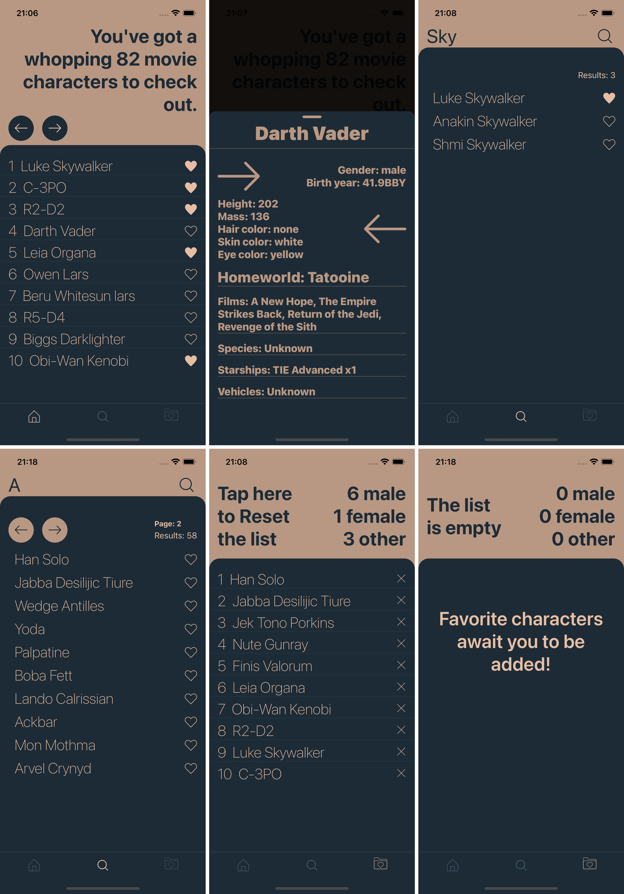

**About**
This is a React Native mobile app for iOS and Android that connects users to the Star Wars universe! 🌌 The app fetches data from the SWAPI API and displays a scrollable list of Star Wars characters. When you tap on a character, you can view more details on a dedicated screen. One cool feature is that you can mark your favorite characters with a simple click on the "Add to favorites" icon. The app keeps track of the total number of male, female, and other favorite characters based on your selections. 👾There is also added a "Reset" button that allows you to clear your favorite character selections and reset the counts to zero. 🔁

**How to use**
1. Clone the Repository
2. Navigate to the Project Folder
3. Install Dependencies using `npm install` or `yarn install`
4. Start the Development Server
5. Run the App on iOS or Android (refer to React Native docs)

**Preview**
